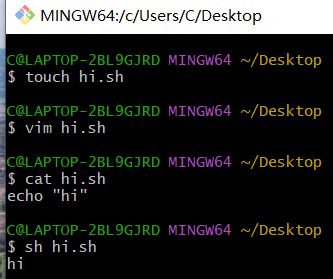
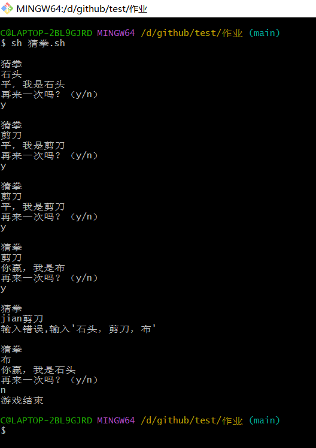

# Level 0
 照着群文件下载了git
照着群文件下载了git

# Level 1

仿照linux系统命令简单使用shell

# Level 2
#!/bin/bash
#详细
#Name:略
#Desc:猜拳,石头（1），剪刀（2），布（3）

while true;do
        echo
        echo "猜拳"
        read a
        b=$((RANDOM % 3 + 1))
        if [ "$a" = "石头" ]; then
                if [ $b -eq 1 ]; then
                        echo "平，我是石头"
                elif [ $b -eq 2 ];then 
                        echo "你赢，我是剪刀"
                else 
                        echo "你输，我是布"
                fi

        elif [ "$a" = "剪刀" ]; then
                if [ $b -eq 2 ]; then
                        echo "平，我是剪刀"
                elif [ $b -eq 3 ]; then
                        echo "你赢，我是布"
                else
                        echo "你输，我是石头"
                fi
        elif [ "$a" = "布" ]; then
                if [ $b -eq 3 ];then 
                        echo "平，我是布"
                elif [ $b -eq 1 ]; then
                        echo "你赢，我是石头"
                else
                        echo "你输，我是剪刀"
                fi
        else
                echo "输入错误,输入'石头，剪刀，布'"
                continue
        fi
        echo "再来一次吗？（y/n）"
        read c
        if [ "$c" != "y" ];then
                echo "游戏结束"
                break
        fi
done
 
shell易错点：
打印用 echo
 if [ "$a" = "石头" ]; then
                if [ $b -eq 1 ]; then
                        echo "平，我是石头"
                elif [ $b -eq 2 ];then
                        echo "你赢，我是剪刀"
                else
                        echo "你输，我是布"
                fi
【】和=要空格
$a  ;then  fi

# Level 3

照着B站视频学会用git上传到github
【【瞎讲软件】通过git命令实现github下载与上传】https://www.bilibili.com/video/BV1J14y1a7ZG?vd_source=8d32b4054931ac3a8853711e9cc414da

其中ssh密钥新建出现问题，复制报错到csdn就知道怎么做了